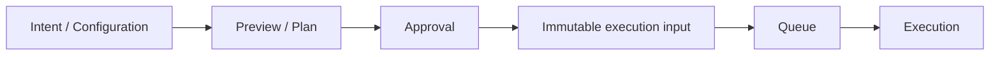
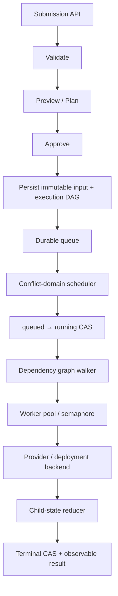

交付平台表面上都在“运行任务”，但真正困难的部分不是启动进程，而是回答一组跨越时间和故障的问题：

- 用户提交的意图是什么？
- 执行前能够看到哪些影响？
- 多个请求同时到达时，哪些可以并行？
- Controller、Runner 或网络失败后，系统从哪里继续？
- 用户看到的状态是否足以解释排队、执行和失败？

前两篇分别分析了 [Harness 的流水线并发模型](/posts/cicd/harness-pipeline-concurrency/)和 [Terraform 的 State 与资源图模型](/posts/cicd/terraform-state-graph-concurrency/)。二者产品边界不同，却共享一组稳定的工程选择。本文以这两个样本为线索，归纳一套适用于长时间交付系统的参考模型。下文是基于案例的设计推导，不将两个产品的做法直接等同于完整的行业标准。

## 两类平台，两种核心问题

Harness 代表通用 CI/CD 编排平台。它的输入通常是代码事件和 Pipeline，核心实例是 Execution，输出是构建结果、制品或一次外部部署调用。

Terraform 代表声明式资源归约引擎。它的输入是 Configuration 和 State，核心工件是 Plan，输出是远端 Resource 状态变化。

| 维度 | Pipeline 平台 | 声明式资源引擎 |
|---|---|---|
| 主要问题 | 哪些步骤在何时、何处运行 | 现实如何收敛到期望状态 |
| 执行单元 | Stage / Step | Resource change |
| 顺序来源 | 显式 Pipeline DAG | 数据引用推导的 Resource DAG |
| 持久身份 | Execution、Stage | Resource address、State |
| 执行前审阅 | Pipeline 定义、参数和检查 | Plan 中的具体变化 |
| 典型并发边界 | 配额、Runner、资源约束 | Workspace / State |

同时承担编排和资源交付的平台往往需要两类能力：外层接收事件、排队并调度执行，内层根据期望输入和依赖图完成领域对象的变化。

## 模式一：声明、计划和执行分离

直接从 API 请求进入副作用执行，短期实现简单，长期会遇到两个问题：

1. 用户在执行前不知道平台最终解释出了什么；
2. Retry 时重新读取输入，可能得到不同结果。

从两个案例可以抽象出以下分层：



Terraform 的 Saved Plan 是典型案例：Plan 先计算变化，审批后 Apply 同一份工件。它冻结的是基于某版 Terraform State 和 plan-time refresh 结果计算出的动作；State lineage/serial 只能发现持久 State 历史变化，不能证明远端对象在 Plan 后没有被绕过 Terraform 修改。Pipeline 平台也会把 commit SHA、解析后的 Pipeline、参数和触发上下文绑定到 Execution。

这样设计的原因包括：

- **可审阅**：用户可以在副作用发生前理解影响；
- **可重现**：执行和 Retry 消费相同输入；
- **可审计**：能够回答批准了什么、最终执行了什么；
- **可缓存与签名**：不可变工件可以计算摘要、做策略校验；
- **隔离输入漂移**：源仓库、模板或配置随后改变，不会静默改变已批准执行。

需要注意，Preview 有两种语义：

- **期望输入快照**：冻结要交付的内容和拓扑，不要求目标现状不变；
- **状态差异计划**：冻结基于某版状态账本和计划阶段观测结果计算出的具体动作。

Terraform 属于后者，因此使用 State serial 防止在已经变化的 Terraform State 历史上执行旧 Plan；它不检测未写回 State 的远端漂移。只冻结期望输入的平台可以借鉴 Plan/Apply 分离，而不必复制完整的远端 State 模型。

## 模式二：提交先持久化，执行异步化

长时间交付不适合绑定 HTTP 请求生命周期。一种常见且适用的设计是先创建持久化 Execution 或 Operation，再由调度器异步推进：

```text
POST submission
  → validate
  → persist execution + graph
  → return execution ID
  → scheduler handles it asynchronously
```

这使 API 能稳定返回一个可查询句柄，并解锁：

- 排队状态和等待原因；
- 日志与进度查询；
- 取消、重试和人工审批；
- 服务重启后的状态重建；
- Webhook、轮询和通知；
- 公平性、优先级和配额。

Harness 的 Execution/Stage queue 属于这一模型。Terraform CLI 本身不是持久队列，但将 Plan 保存为工件后，也可以由外部自动化平台异步审批和 Apply。

## 模式三：并发不是一个数字，而是多个层次

“最大并发 20”只描述容量，不能保证业务正确性。分析 Harness 和 Terraform 后，可以把并发问题至少区分为四层：

| 层次 | 回答的问题 | 常见机制 |
|---|---|---|
| 拓扑并发 | 哪些节点已满足依赖 | DAG |
| 业务并发 | 哪些执行会修改重叠目标 | concurrency key、resource group、environment lock |
| 平台配额 | 一个租户或项目能占多少容量 | quota、rate limit、fair queue |
| 执行容量 | 当前 Runner 能跑多少任务 | worker pool、Semaphore、labels |

Harness 的 DAG、Stage/Repository limit 和 Runner workers分别覆盖拓扑、配额与容量。Terraform 使用 Resource DAG 和全局 Semaphore控制单次 Apply 的并行度，再用 State Lock串行化同一状态账本的写入。

分层的原因是这些约束变化速度不同：

- 业务冲突随领域模型变化；
- 平台配额随租户等级和成本策略变化；
- Runner 容量随集群弹性变化；
- DAG 依赖由每次提交的输入决定。

把它们压成一把全局锁会损失并行度；只保留一个 worker 数字又会漏掉真实资源冲突。

## 模式四：冲突域与所有权边界一致

并发控制的关键不是“有没有锁”，而是“锁住什么”。

Terraform 选择 State 作为边界，因为 State 是完整写入的一致性账本。同一 State 的 Apply 串行，不同 State 可以并行。代价是必须保证一个远端 Resource 只有一个 State owner。

通用 Pipeline 平台无法理解所有目标资源，因此常让用户声明 concurrency key 或 resource constraint，例如：

```text
production-cluster/payment-service
```

拥有领域模型的交付平台则可以从稳定资源身份推导冲突域。理想的冲突关系不是简单字符串相等，还可能包括层级重叠：

```text
environment
└── service
    └── application
```

上层操作与其所有下层操作冲突，不相交的 sibling 可以并行。这比整个平台全局串行更高效，也比任意 Pipeline name 更准确。

设计冲突域时需要满足：

- 身份稳定，不依赖展示名称；
- 能覆盖所有可能产生共享副作用的动作；
- 用户可以理解为何排队；
- 范围足够小，避免无关执行互相阻塞；
- 变更冲突规则时有明确的兼容策略。

## 模式五：重复发现，条件状态转换

分布式队列很难经济地保证“一个任务永远只被一个 worker 看见”。网络超时、进程重启和至少一次消息投递都可能造成重复发现。

因此，允许重复投递的交付系统通常把正确性放在持久状态转换上：

```sql
UPDATE execution
SET status = 'running', version = version + 1
WHERE id = ? AND status = 'queued' AND version = ?;
```

Harness 即使使用队列 Mutex，Runner 接受 Stage 时仍执行 version CAS。Terraform 则通过 State Lock 和 serial 保证一个状态历史不会被两个协作写入者覆盖。

这种模型的优势是：

- 队列扫描可以重复；
- 唤醒通知可以丢失后重建；
- Controller 重启可以重新列出非终态对象；
- 多个竞争者只有一个状态转换成功；
- 不需要把远端副作用包含在数据库长事务中。

条件更新不能自动使外部调用恰好一次。目标动作仍应尽量具备幂等语义、稳定业务身份或可接受的重复执行结果。

## 模式六：DAG 负责依赖，Semaphore 负责压力

DAG 和 Semaphore 经常被误认为两种替代方案，实际上它们解决不同问题：

```text
DAG:          B 是否必须等待 A？
Semaphore:    当前最多允许多少个已就绪节点同时执行？
Rate limit:   每秒最多向目标 API 发送多少请求？
```

Terraform 的 Graph Walker 会在依赖完成后立即放行节点，但实际执行还要获取默认容量为 10 的 Semaphore。Harness 同样把 Stage dependency、Runner matching 和 ParallelWorkers分开。

这种组合同时获得：

- 拓扑正确性；
- 可预测的资源消耗；
- 无依赖节点的吞吐；
- 针对不同 Runner pool 的容量隔离。

## 模式七：终态是可依赖的强语义

如果父 Execution 已显示成功，后台仍有 Stage 运行，查询、重试、计费和资源释放都会失去统一依据。对持久工作流而言，一套可依赖的终态契约通常要求：

- 所有必须执行的 child 已进入终态；
- 不再有等待依赖或可以继续调度的节点；
- reducer 根据 child 状态归约父状态；
- 并发 reducer 使用期望状态或版本条件提交结果。

Harness 会在所有 Stage 完成后归约 Execution。Terraform 的成功 Apply 表示计划图已经执行完成；失败 Apply 则可能留下已经成功创建并持久化的部分结果，它并不是与 Harness 同构的父子状态 reducer。对持久工作流建立强终态，可以让上层系统把 Completion 当作事实，而不是提示。

## 模式八：排队必须可观察

持久队列只有在用户知道“为什么等”时才是产品能力，否则只是延迟。

为了让排队成为可操作的产品能力，平台可以提供：

- 当前状态：queued、running、waiting approval、terminal；
- 队列位置或等待时长；
- blocker 或资源约束；
- 哪个并发额度已经耗尽；
- 哪些上游依赖未完成；
- cancel、retry 和 supersede 操作。

Harness 的 Executions Management 就在补充账户级 queued execution 视图，不过该能力目前受 `PIPE_QUEUED_PIPELINE_OBSERVABILITY` Feature Flag 控制。声明式平台则常在 Plan 中展示动作原因和依赖影响。可观察性减少了用户通过重复提交来“碰运气”的冲动，也降低了运维人员直接修改数据库状态的需求。

## 常见反模式

### 用数据库长事务包住远端执行

远端调用可能持续数分钟甚至数小时。长事务会占用连接、扩大锁范围，并且无法与外部系统形成真正原子提交。数据库事务应负责持久意图和短状态转换，远端执行由可重建的异步控制器推进。

### 用全局锁解决所有冲突

全局锁容易实现，却把所有无关执行串行化。更合理的方式是识别稳定的资源身份和最小安全冲突域。

### 先检查空闲，再创建执行

`if idle then insert`在多个 API 实例下存在检查—执行竞争。应使用唯一约束、版本 CAS，或先接受为 queued 再由单一调度权威决定何时运行。

### Preview 和执行重新计算两次

如果执行阶段重新读取源数据和模板，Preview 无法代表真实副作用。应冻结经过确认的输入，或在执行前明确生成并再次审阅最终 Plan。

### 把机器容量当业务互斥

worker pool 只能防止机器过载，无法判断两个任务是否修改同一目标。业务冲突必须由资源身份或显式 concurrency key 表达。

## 一套可演进的参考架构

综合 Harness 和 Terraform，可以得到一条通用的交付控制链：



每一层只承担一种责任：

- API 提交意图；
- Preview 解释影响；
- Snapshot 固定批准内容；
- Queue 吸收并发和故障；
- Scheduler 判断执行之间是否冲突；
- DAG 判断执行内部依赖；
- Worker pool 控制容量；
- Provider 处理目标系统语义；
- Reducer 提交可信终态。

## 为什么这些模式会反复出现

这些设计并非为了追求复杂架构，而是对几个现实约束的回应：

1. **交付持续时间远大于请求生命周期**，因此必须持久化和异步执行；
2. **故障与重复投递不可避免**，因此必须允许重复发现并以条件状态转换收敛；
3. **执行输入会变化**，因此 Preview 与不可变工件必须建立明确边界；
4. **依赖和容量是不同问题**，因此 DAG 与 Semaphore必须分层；
5. **全局串行无法扩展**，因此并发边界必须贴合资源所有权；
6. **用户需要理解等待和失败**，因此队列、Plan 和终态必须可观察。

Harness 展示了通用 Pipeline 平台如何组织 Execution、队列、Runner 和 CAS；Terraform 展示了声明式系统如何组织 Configuration、Plan、State、Dependency Graph 和 Apply。一个面向具体领域的交付平台，可以在二者之间找到自己的边界：吸收通用控制模式，同时把真正的竞争关系建立在自身可解释的资源模型上。

## 参考资料

- [Harness Open Source repository](https://github.com/harness/harness)
- [Harness Pipeline settings](https://developer.harness.io/docs/platform/pipelines/pipeline-settings/)
- [Harness Executions Management](https://developer.harness.io/docs/platform/pipelines/executions-and-logs/executions-management)
- [Terraform workflow](https://developer.hashicorp.com/terraform/cli/run)
- [Terraform dependency graph](https://developer.hashicorp.com/terraform/internals/graph)
- [Terraform state locking](https://developer.hashicorp.com/terraform/language/state/locking)
