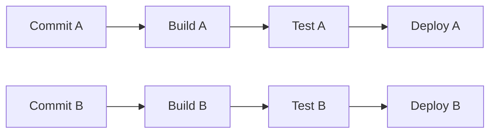
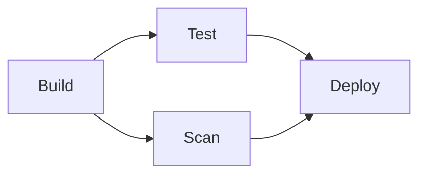
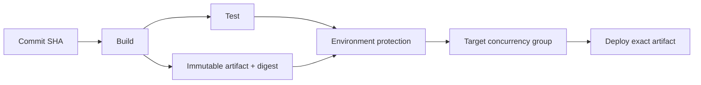

同一仓库的多个代码事件连续到达时，GitHub Actions 会为每个匹配 `on:` 的事件创建独立的 Workflow Run，并把 Run 绑定到该事件关联的 Commit SHA 和 Git ref。一次 [`push`事件](https://docs.github.com/en/actions/reference/workflows-and-actions/events-that-trigger-workflows#push)可以包含多个 Commit，但通常只触发一次 Run，`GITHUB_SHA`指向被推送 Git ref 的最新 Commit。当多个 Push 等事件先后触发多个 Run 时，这些 Run 默认可以同时构建、测试和部署。构建通常只消耗计算资源，并行能够缩短反馈时间；部署却会修改共享目标，两个 Run 即使关联不同 Commit，也可能互相覆盖。

GitHub Actions 没有尝试理解 Kubernetes Namespace、云资源或应用拓扑。它把依赖顺序、人工准入和目标互斥拆成几个相互独立的抽象，再由 Workflow 作者声明它们之间的关系。本文分析这套模型如何处理多个 Commit 的并发，并讨论它在哪种意义上属于 Plan/Execute，以及领域交付平台可以从中借鉴什么。

## 核心抽象

| 抽象 | 作用 |
|---|---|
| Workflow | 仓库中的自动化定义，由事件触发 |
| Workflow Run | Workflow 的一次执行，绑定触发事件关联的 Commit SHA 和 Git ref |
| Job | 可独立调度到 Runner 的执行单元 |
| `needs` | Job 之间的显式依赖，形成执行 DAG |
| Artifact | 在 Job 或 Run 之间传递的构建产物 |
| Environment | 部署目标的治理入口，承载保护规则、Secrets、Variables 和部署记录 |
| Concurrency Group | 用户声明的互斥键，同组最多运行一个 Job 或 Workflow Run |

根据 GitHub 的 [Workflow 运行模型](https://docs.github.com/en/actions/concepts/workflows-and-actions/workflows)，触发事件关联一个 Commit SHA 和 Git ref，每次 Run 使用该版本中的 Workflow 定义，并暴露 `GITHUB_SHA` 与 `GITHUB_REF`。因此不同匹配事件创建的是彼此独立的执行实例，不是同一个可变 Run 被反复更新。

这个绑定只覆盖 GitHub 已经固定的上下文。若 Workflow 在部署阶段主动拉取最新分支、重新读取可变配置，或者使用会移动的外部引用，执行输入仍然可能漂移。

## 默认行为：Run 之间并行

假设 Commit A 和 Commit B 通过两次 Push 先后进入主分支，每个事件触发的 Run 都包含 Build、Test 和 Deploy：



`needs`只约束同一次 Run 内的 Job 依赖。Build B 不必等待 Deploy A，Deploy A 和 Deploy B 也不会因为名称相同而自动串行。GitHub Actions 的默认策略优先提供流水线吞吐，不推断两个部署是否修改同一目标。

这意味着并发问题需要分层处理：

- Job DAG 决定一个 Run 内哪些工作已经满足依赖；
- Runner 容量决定当前能够承载多少 Job；
- Concurrency Group 决定哪些 Run 或 Job 不能同时执行；
- Environment 决定部署前需要通过哪些治理条件。

Runner 数量增加只能提高执行容量，不能消除部署目标冲突。

## `needs`是流程图，不是资源变更计划

GitHub Actions 使用 [`jobs.<job_id>.needs`](https://docs.github.com/en/actions/reference/workflows-and-actions/workflow-syntax#jobsjob_idneeds)表达 Job 依赖。没有依赖关系的 Job 可以并行，依赖失败时，下游默认跳过，Workflow 也可以通过条件表达式改变这一行为。

例如，测试和安全扫描都依赖构建，部署等待二者完成：



这个 DAG 是控制流计划：它描述 Job 的先后关系，却不描述 Deploy 将修改哪些对象，也不会计算两个 Deploy 的资源集合是否重叠。Workflow 作者必须把目标身份编码到并发键，或把部署交给能够理解目标资源的外部系统。

## Concurrency Group：显式声明冲突域

GitHub Actions 可以在 Workflow 级或 Job 级配置 [`concurrency`](https://docs.github.com/en/actions/how-tos/write-workflows/choose-when-workflows-run/control-workflow-concurrency)。对于部署场景，Job 级配置通常更精确：Build、Test 可以继续并行，只有产生共享副作用的 Deploy 需要等待。

```yaml
jobs:
  build:
    runs-on: ubuntu-latest
    steps:
      - run: ./build.sh

  deploy:
    needs: build
    runs-on: ubuntu-latest
    environment: production
    concurrency:
      group: deploy-production-payment
      queue: max
    steps:
      - run: ./deploy.sh
```

这里的 `deploy-production-payment`不是锁的实现细节，而是 Workflow 作者声明的冲突域。同一仓库中，使用相同键的 Job 或 Run 最多只有一个处于运行状态。组名大小写不敏感。

并发组还包含一项容易被忽略的队列策略：

| 配置 | 运行中 | 等待中 | 新请求到达后的行为 |
|---|---:|---:|---|
| 默认 `queue: single` | 最多 1 个 | 最多 1 个 | 新等待者替换并取消旧等待者 |
| `queue: max` | 最多 1 个 | 最多 100 个 | 队列未满时保留请求，满后取消新增请求 |
| `cancel-in-progress: true` | 新请求可取消运行者 | 最多 1 个 | 适合只关心最新结果的任务 |

`queue: max` 与 `cancel-in-progress: true`不能组合。等待项按照开始等待并发组的时间以 FIFO 方式处理，但这不等同于 Workflow 的触发顺序，因为不同 Run 到达部署 Job 的时间可能不同。

这三种行为表达的是不同产品语义：

- CI 校验通常只关心某个分支的最新结果，可以取消旧 Run；
- Production 部署如果每个版本都必须经过，应保留完整队列；
- Staging 环境若只要求最终收敛到最新版本，可以替换尚未开始的等待者，但是否取消正在部署的版本仍需谨慎。

因此，“同一目标串行”只回答能否同时运行，不能替代“哪些请求允许被丢弃”的业务决策。

## Environment 与 Concurrency 相互正交

[Environment](https://docs.github.com/en/actions/reference/workflows-and-actions/deployments-and-environments)可以配置人工审批、等待时间、允许部署的 Branch 或 Tag，以及由 GitHub App 实现的自定义保护规则。Job 在保护规则通过前不会开始，也不能读取该 Environment 的 Secrets。默认情况下，引用 Environment 的 Job还会形成 Deployment 与 Deployment Status 记录；可以通过 `environment.deployment: false`关闭记录，但此时不能使用依赖 Deployment object 的 GitHub App 自定义保护规则。

Environment 本身并不自动串行部署。GitHub 的 [部署文档](https://docs.github.com/en/actions/how-tos/deploy/configure-and-manage-deployments/control-deployments)明确区分了二者：

- Environment name 表示治理和审计上下文；
- Concurrency Group 是任意字符串，不必等于 Environment name；
- 另一个 Workflow 即使引用同一 Environment，只要没有声明相同 Concurrency Group，就不受该互斥规则约束。

它们在界面状态上也有区别。等待 Environment 审批的 Job 显示为 `Waiting`，等待 Concurrency Group 的 Job 或 Run 显示为 `Pending`。这说明“尚未执行”不是一个充分的可观测状态，平台还需要指出等待的是依赖、审批、并发域还是 Runner。

## 多个 Commit 的推荐部署结构

若希望构建并行、部署串行，并确保批准内容与实际执行一致，可以把流程组织为：



其中有四个关键约束：

1. Build 和 Test 绑定触发 Run 的 Commit SHA；
2. Build 只生成一次 Artifact，并记录不可变版本或摘要；
3. 审批对象能够关联到这个确切 Artifact，而不只是一个分支名；
4. Deploy 消费同一 Artifact，不在执行前重新构建或读取最新分支。

[Workflow Artifact](https://docs.github.com/en/actions/tutorials/store-and-share-data)可以在 Job 之间传递文件，但 Artifact 是否具有完整供应链保证，还取决于命名、保留策略、摘要校验和 Artifact Attestation 等外围设计。GitHub Actions 提供了组合这些能力的基础，并不会自动把任意部署脚本变成不可变执行。

## GitHub Actions 是否属于 Plan/Execute

答案取决于 Plan 的定义。

如果 Plan 指控制流，那么 GitHub Actions 是 Plan/Execute：

- Workflow YAML 声明 Job、依赖、条件和运行环境；
- 触发事件生成绑定 Commit 的 Workflow Run；
- Runner 按 DAG 和条件执行 Job。

如果 Plan 指“执行前计算目标资源的具体变化”，GitHub Actions 本身不是这样的系统。它没有通用的目标 State、资源级 Diff、所有权账本或过期计划检测。一个 `deploy.sh`会修改什么，Actions 调度器并不知道。

GitHub Actions 可以承载 Terraform Plan、Kubernetes Diff 或领域 Preview，再把输出作为审批工件传递给 Deploy Job。此时语义计划来自外部引擎，Actions 提供事件触发、控制流、审批、队列和 Runner。两层职责不应混淆：

| 层次 | GitHub Actions 原生提供 | 需要部署工具或交付平台提供 |
|---|---|---|
| 流程计划 | Job DAG、条件、Matrix | — |
| 输入身份 | Commit SHA、Run context、Artifact | 可变外部输入的冻结策略 |
| 准入 | Environment protection rules | 领域策略与风险判断 |
| 冲突控制 | 用户声明的字符串并发组 | 资源重叠推导、跨仓库协调 |
| 变更预览 | 承载和展示步骤输出 | 目标 Diff 与具体 Action |
| 执行 | Runner 执行脚本或 Action | 幂等部署与目标状态归约 |

## Concurrency Group 的能力边界

Concurrency Group 轻量且通用，但它有清晰的适用范围。

首先，同组协调发生在一个仓库内。GitHub 还提供了仓库级 [Concurrency Groups REST API](https://docs.github.com/en/rest/actions/concurrency-groups)，用于查询活跃的组及其运行、等待成员，但它不是跨仓库的全局资源锁。两个仓库部署同一集群和应用时，名称相同的组不会自动形成共同并发域。

其次，Group 使用字符串相等判断冲突，不理解资源层级或集合重叠。以下三个键对 Actions 而言互不相同：

```text
cluster-a
cluster-a/payment
cluster-a/payment/api
```

若上层操作与所有下层操作都冲突，Workflow 作者需要统一命名规则、使用更粗的键，或把调度交给外部平台。一个 Job 同时修改多个独立目标时，单个字符串键也很难原子地表达“必须同时占用多个并发域”。

最后，Concurrency 约束的是协作使用该配置的 Actions Job。绕过 Workflow 的人工操作、其他 CI 系统和直接调用目标 API 的程序不受它保护。

## 对交付平台的启示

GitHub Actions 的价值不在于提供最强的领域调度器，而在于用少量正交抽象覆盖大量通用自动化场景。从中可以归纳出六点设计启示。

### 1. 容量与冲突分开

Runner pool、组织配额和并发组不是同一个概念。机器空闲不代表两个部署可以同时执行，目标不冲突也不代表当前有足够执行容量。

### 2. 冲突键来自部署目标

按 Branch 或 Workflow name 分组适合取消重复 CI；部署互斥应尽量来自稳定的目标身份。否则两个 Branch 部署同一目标仍会冲突，两个目标不同的部署却可能被无谓串行。

### 3. 队列策略必须显式

保留全部、替换等待者和取消运行者对应不同的交付承诺。平台不应把 `latest wins`当作所有场景的默认正确答案，也不应只实现串行而忽略排队上限与溢出行为。

### 4. 审批需要绑定不可变输入

Environment 解决“谁可以放行”，Artifact 和摘要解决“放行的是什么”。若 Deploy 重新读取最新输入，审批记录与最终副作用之间仍然可能断开。

### 5. Waiting 需要结构化原因

`Pending`与`Waiting`的区分虽然简单，却能让使用者判断下一步应增加 Runner、等待前序部署、请求审批还是修复依赖。成熟平台应把状态与原因分开，避免用一串日志承担全部诊断语义。

### 6. 领域平台可以做得更深

通用 CI 平台只能要求用户声明字符串键。掌握资源模型的交付平台可以进一步推导层级重叠、一次执行的多目标占用和跨仓库冲突，并把等待原因映射回用户理解的资源。这是领域平台相对通用 Workflow 引擎最有价值的差异之一。

## 与 Harness、Terraform 的位置关系

前文已经分别分析了 [Harness 的 Pipeline 并发](/posts/cicd/harness-pipeline-concurrency/)和 [Terraform 的 State 与 Dependency Graph](/posts/cicd/terraform-state-graph-concurrency/)。三者可以放在同一坐标系中理解：

| 系统 | 主要抽象 | 执行间冲突边界 | 执行内并行 | Plan 语义 |
|---|---|---|---|---|
| GitHub Actions | Workflow Run / Job | 用户声明的 Concurrency Group | `needs` DAG、Matrix | 控制流计划 |
| Harness | Execution / Stage / Runner | Pipeline、Stage 或资源约束 | Stage DAG、Runner capacity | Pipeline 执行计划 |
| Terraform | Configuration / Plan / State | State ownership 与 State Lock | Resource DAG、Semaphore | 资源变更计划 |

GitHub Actions 展示了最轻量的一端：平台不理解目标语义，却用 Commit identity、Job DAG、Environment 和 Concurrency Group建立了可组合的控制面。Terraform 位于语义更强的一端：它理解资源、状态和变更计划。Harness 则强调持久 Execution、Stage 调度与 Runner。

这也补充了 [交付平台参考模型](/posts/cicd/delivery-platform-industry-patterns/)中的结论：通用机制可以负责触发、队列和执行，真正影响交付正确性的冲突域、不可变输入与目标归约，最终仍要由最理解资源的一层承担。

## 参考资料

- [GitHub Actions: Workflows](https://docs.github.com/en/actions/concepts/workflows-and-actions/workflows)
- [Events that trigger workflows: `push`](https://docs.github.com/en/actions/reference/workflows-and-actions/events-that-trigger-workflows#push)
- [Workflow syntax: `needs`](https://docs.github.com/en/actions/reference/workflows-and-actions/workflow-syntax#jobsjob_idneeds)
- [Control workflow and job concurrency](https://docs.github.com/en/actions/how-tos/write-workflows/choose-when-workflows-run/control-workflow-concurrency)
- [Deploying with GitHub Actions](https://docs.github.com/en/actions/how-tos/deploy/configure-and-manage-deployments/control-deployments)
- [Deployments and environments](https://docs.github.com/en/actions/reference/workflows-and-actions/deployments-and-environments)
- [Store and share data with workflow artifacts](https://docs.github.com/en/actions/tutorials/store-and-share-data)
- [REST API for Actions concurrency groups](https://docs.github.com/en/rest/actions/concurrency-groups)
