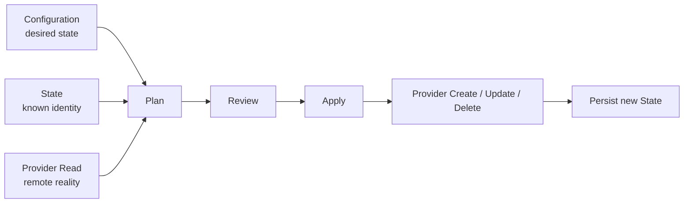

Terraform 经常出现在 CI/CD 流水线中，但它本身不是完整的持续集成或持续交付平台。[Terraform Core](https://github.com/hashicorp/terraform/tree/1eba5d7da31f0d6f0858316ab8a453adc71d3634)包含配置解析、表达式求值、Provider 协议、State 管理、Plan 计算、Dependency Graph 和 Apply 引擎；云主机、Kubernetes、数据库等具体资源通常由独立 Provider 实现。

Terraform 解决的核心问题是：已知用户声明的期望状态和远端系统的当前状态，如何计算并执行一组有序变化，使现实收敛到声明。

## 核心抽象

| 抽象 | 定义 |
|---|---|
| Configuration | 使用 HCL 声明的期望状态 |
| Resource | 具有稳定地址和生命周期的远端对象 |
| Provider | Terraform Core 与云、集群或 SaaS API 之间的适配器 |
| State | Resource address 与远端对象身份、已知属性之间的持久映射 |
| Plan | 从当前状态到期望状态的变更集合 |
| Dependency Graph | 根据资源引用和生命周期规则生成的执行依赖图 |
| Backend / State Store | 保存 State，并在支持时提供互斥锁 |

这些抽象形成一条完整的数据流：



## Resource：被管理对象而不是执行步骤

Terraform 的 `Resource` 表示一个拥有生命周期的对象，例如虚拟机、DNS Record 或 Kubernetes Deployment。它通过地址获得稳定身份：

```text
module.network.aws_subnet.private["az-a"]
```

这个地址不是一次任务的编号，而是 Configuration 和 State 共同使用的逻辑身份。Provider 再把它映射到远端系统的实际 ID。

这解释了 Terraform 为什么需要 State：仅凭 Configuration 很难知道声明中的地址对应远端哪一个对象。State 不是普通缓存，而是逻辑资源身份和真实对象身份之间的账本。Terraform 官方的 [State 文档](https://developer.hashicorp.com/terraform/cli/state)也强调，错误地手工修改 State 可能让 Terraform 失去对真实资源的追踪。

## Plan：把计算变化与执行变化分开

`terraform plan`默认执行三件事：

1. 通过 Provider 读取已管理对象的当前状态；
2. 将当前状态与 Configuration 的期望状态比较；
3. 生成 create、update、replace、delete 或 no-op 等变化。

Plan 本身不修改远端资源。使用者可以先审阅变化，再决定是否 Apply。官方 [Plan 命令文档](https://developer.hashicorp.com/terraform/cli/commands/plan)还区分两种形态：

- **Speculative plan**：用于预览和代码评审，不承诺以后执行的还是这份结果；
- **Saved plan**：使用 `-out` 保存，随后交给 `terraform apply`执行。

Saved plan 把“审批”绑定到一个具体的执行工件。Apply 时不能再追加会改变决策的 planning options，因为那些决策已经冻结在 Plan 中。Terraform 同时提醒 Plan 可能包含敏感数据，不应直接提交到版本库。

Plan 的价值不只是输出一段 diff，而是建立了一条可审阅边界：

```text
声明输入 → 读取现实 → 计算变化 → 冻结计划 → 审批 → 执行计划
```

## Dependency Graph：依赖决定并行

Terraform 不要求用户手工排列所有 Resource 的执行顺序。资源引用会形成依赖：

```hcl
resource "example_network" "main" {}

resource "example_subnet" "private" {
  network_id = example_network.main.id
}
```

`subnet`引用了`network.id`，因此 Graph 中自动出现依赖边。`depends_on`可以补充数据引用无法表达的隐藏依赖。Terraform 还会加入 Provider configuration、destroy ordering、root 等内部节点，并在执行前检查环。

Graph Walker 的规则是：

- 节点只有在所有依赖完成后才执行；
- 多个同时就绪且互不依赖的节点可以并行；
- 上游失败时，依赖它的下游不再正常执行。

Terraform 官方的 [Dependency Graph 文档](https://developer.hashicorp.com/terraform/internals/graph)和源码中的 [`dag.Walker`](https://github.com/hashicorp/terraform/blob/1eba5d7da31f0d6f0858316ab8a453adc71d3634/internal/dag/walk.go)都明确将 Graph Walk 设计为并行过程。

## 单次执行：Semaphore 限制并行度

DAG 决定哪些节点可以并行，但不代表所有就绪节点都应立即调用 Provider。Terraform 使用全局 Semaphore 限制并发操作数：

- 默认并行度为 10；
- `-parallelism=n`可以调整；
- 每个可执行 Graph Node 在进入实际执行前获取 slot；
- 执行结束后释放 slot。

对应实现位于：

- [`terraform.NewContext`](https://github.com/hashicorp/terraform/blob/1eba5d7da31f0d6f0858316ab8a453adc71d3634/internal/terraform/context.go)
- [`Semaphore`](https://github.com/hashicorp/terraform/blob/1eba5d7da31f0d6f0858316ab8a453adc71d3634/internal/terraform/semaphore.go)
- [`ContextGraphWalker.Execute`](https://github.com/hashicorp/terraform/blob/1eba5d7da31f0d6f0858316ab8a453adc71d3634/internal/terraform/graph_walk_context.go)

这个限制首先保护运行 Terraform 的机器，并降低同时压向 Provider 的请求量。具体 API 的限流和退避仍可以由 Provider client 处理，`parallelism`不是完整的远端 API 流控协议。

## 多次执行：同一 State 外层串行

Resource Graph 内部可以并行，但可能写同一份 State 的两个 Terraform 操作不能安全并行。否则会发生典型的丢失更新：

```text
Apply A reads State serial 41
Apply B reads State serial 41
A writes serial 42
B writes its own serial 42 and overwrites A
```

支持锁的 Backend 会在可能写 State 的操作前自动获取 State Lock。获取失败时 Terraform 不继续；使用者可以设置 `-lock-timeout`等待一段时间。官方 [State Locking](https://developer.hashicorp.com/terraform/language/state/locking)说明，关闭锁可能导致多个写入者破坏 State。

源码把锁抽象成返回 opaque lock ID 的 [`statemgr.Locker`](https://github.com/hashicorp/terraform/blob/1eba5d7da31f0d6f0858316ab8a453adc71d3634/internal/states/statemgr/locker.go)。锁信息包含 operation、用户、主机、Terraform version 和创建时间，便于在锁遗留时诊断。这里的锁保护 Terraform 自己的状态账本，不是对每个远端 Resource 分别加锁。

## Saved Plan：State lineage 和 serial 防止过期执行

State Lock 防止两个协作进程同时写入，Saved Plan 还需要防止“基于旧 State 审批的计划”在新 State 上执行。

State file 带有：

- `lineage`：一条 State 历史的身份；
- `serial`：该历史中的递增版本。

Apply Saved Plan 时，除初始空 State 的首次 Plan 这一特殊情况外，Terraform 检查 Plan 的 prior State 与当前 State：

- lineage 不同，说明不是同一条 State 历史；
- serial 不同，说明 Plan 创建后 State 已被其他操作修改。

出现任一情况都会拒绝旧 Plan。对应检查位于 [local backend](https://github.com/hashicorp/terraform/blob/1eba5d7da31f0d6f0858316ab8a453adc71d3634/internal/backend/local/backend_local.go)。

因此 Terraform 的并发保护由两部分构成：

```text
State Lock
  └─ 防止操作期间出现另一个协作写入者

State lineage + serial
  └─ 防止执行基于旧 State 生成的 Saved Plan
```

## State Lock 的边界

State Lock 只协调使用同一 Backend key 和 Workspace 的 Terraform 操作。假设两份 State 错误地管理了同一个远端对象，它们仍可能并行：

```text
workspace-a/state ─┐
                   ├─ remote object X
workspace-b/state ─┘
```

Terraform Core 无法仅根据两份独立 State 判断这种所有权冲突。工程上必须保证一个远端 Resource 只有一个 State owner，并依赖 Provider API 的唯一约束、版本控制和幂等语义处理目标侧竞争。

这也是 Terraform 没有把 State Lock 设计成“全云平台大锁”的原因：锁的边界与一份可独立演进的状态账本一致，不同 Workspace 才能真正并行。

## 两层并发模型

Terraform 的并发模型可以归纳为：

| 层次 | 机制 | 原因 |
|---|---|---|
| Operation 层 | 同一 State 的互斥锁 | 防止多个写入者破坏状态账本 |
| Plan 层 | lineage + serial | 防止过期计划作用于新状态 |
| Graph 层 | Dependency DAG | 保证资源拓扑顺序 |
| Capacity 层 | Semaphore，默认 10 | 控制单次执行的最大并发 |
| Provider 层 | API identity、重试和限流 | 处理目标系统的具体语义 |

最值得注意的组合是“外层串行、内层并行”：Terraform 不允许两次 Apply 同时改写同一份 State，但会在一次 Apply 中最大化无依赖 Resource 的并行度。

## 设计取舍

Terraform 的粗粒度 State Lock 经常被批评限制并发，但它与 State 的一致性边界完全一致。若要提高不同团队和系统之间的并行度，正确方向通常不是绕过锁，而是重新划分 State ownership，让能够独立演进的资源进入不同 State，同时禁止重叠管理。

另一方面，Saved Plan 的价值依赖于清晰语义：它冻结的是基于某版远端状态计算出的具体 Resource actions。若一个系统只想冻结“期望输入”，不要求目标现状保持不变，那么它可以借鉴 Plan/Apply 分离，但不必复制 Terraform 的全部 refresh、State ownership 和 stale-plan 规则。

## 参考资料

- [Terraform Core repository](https://github.com/hashicorp/terraform/tree/1eba5d7da31f0d6f0858316ab8a453adc71d3634)
- [Terraform workflow](https://developer.hashicorp.com/terraform/cli/run)
- [Terraform plan command](https://developer.hashicorp.com/terraform/cli/commands/plan)
- [Terraform apply command](https://developer.hashicorp.com/terraform/cli/commands/apply)
- [Terraform dependency graph](https://developer.hashicorp.com/terraform/internals/graph)
- [Terraform state locking](https://developer.hashicorp.com/terraform/language/state/locking)
