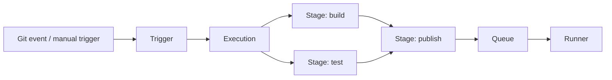
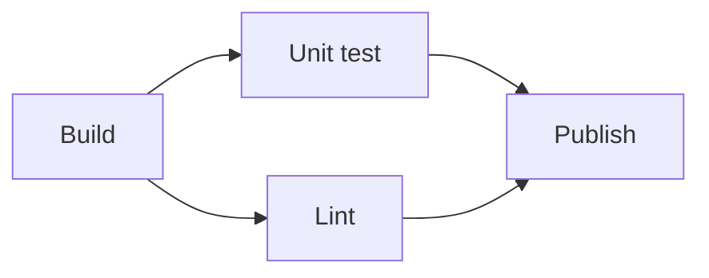
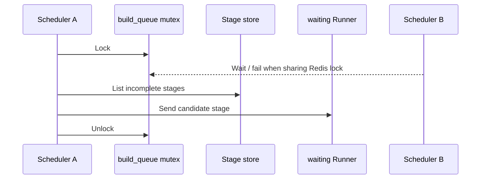

Harness 的产品范围很宽，容易让初次接触者把代码托管、持续集成、持续交付、制品仓库和开发环境混为一个概念。本文把范围限定在 [Harness Open Source](https://github.com/harness/harness/tree/97441a2f618525bbcc5f83cd0237d667a32abb0f)：它由 Drone 的持续集成能力演进而来，在同一平台中提供代码托管、自动化 Pipeline、Gitspaces 和 Artifact Registry。Harness 商业版还包含更完整的持续交付和治理能力，不在本文源码分析范围内。

本文关注两个问题：Harness 用什么对象表达一次流水线执行，以及多个执行、多个 Stage、多个 Runner 同时工作时，平台怎样避免重复领取和失控并发。

## 核心抽象

| 抽象 | 定义 |
|---|---|
| Repository | 保存代码、分支和提交，也是 Pipeline 的代码上下文 |
| Pipeline | 自动化过程的声明，定义有哪些 Stage 及其依赖 |
| Stage | 可独立调度的执行阶段，可以声明运行环境、依赖和并发限制 |
| Step | Stage 内实际运行的命令、容器或插件 |
| Trigger | 将 push、tag、Pull Request、定时或手工事件转换成一次执行 |
| Execution | Pipeline 的一次具体运行，绑定提交、触发来源和运行状态 |
| Runner | 从队列领取 Stage，在匹配的运行环境中执行并回传状态与日志 |

Pipeline 是定义，Execution 是实例。这一分离让同一个 Pipeline 可以由不同提交反复触发，每次 Execution 都拥有独立的 Stage 状态和日志。



源码中的 [`Pipeline`](https://github.com/harness/harness/blob/97441a2f618525bbcc5f83cd0237d667a32abb0f/types/pipeline.go)、[`Stage`](https://github.com/harness/harness/blob/97441a2f618525bbcc5f83cd0237d667a32abb0f/types/stage.go)、[`Step`](https://github.com/harness/harness/blob/97441a2f618525bbcc5f83cd0237d667a32abb0f/types/step.go) 和 [`Execution`](https://github.com/harness/harness/blob/97441a2f618525bbcc5f83cd0237d667a32abb0f/types/execution.go) 是相互独立的持久化模型，并非运行时临时拼出的一个大对象。

## Pipeline 内部：依赖图决定并行机会

Harness 为 Stage 建立有向无环图。一个 Stage 只有在直接依赖进入终态后才具备运行条件；互不依赖的 Stage 可以同时运行。

例如，测试和静态检查都依赖构建，但彼此没有依赖：



`Unit test` 和 `Lint` 可以并行，`Publish` 必须等待二者完成。若上游失败，平台再结合 `on_success` 和 `on_failure` 判断下游应运行还是跳过。源码中的 [DAG 实现](https://github.com/harness/harness/blob/97441a2f618525bbcc5f83cd0237d667a32abb0f/app/pipeline/triggerer/dag/dag.go)负责依赖与环检测，[teardown](https://github.com/harness/harness/blob/97441a2f618525bbcc5f83cd0237d667a32abb0f/app/pipeline/manager/teardown.go)在 Stage 完成后检查并调度下游。

这里包含一个重要分层：

- DAG 回答哪些节点现在可以执行。
- 并发限制回答允许其中多少节点同时执行。
- Runner 容量回答当前是否有机器能够承载这些节点。

三者分别表达拓扑正确性、平台配额和实际资源容量。

## 多个 Execution：队列和限流

多个 Execution 默认可以并行。Harness Open Source 的 Scheduler 会从持久化存储中读取未完成 Stage，再根据以下条件匹配等待中的 Runner：

- Stage 类型和执行资源类型；
- 操作系统、CPU 架构、Kernel 和 Variant；
- Runner label；
- Stage 自身的并发限制；
- Repository 级并发限制。

Stage 的 `Limit` 按“同一 Repository、同一 Stage name”统计较早或正在运行的 sibling。Repository 的 `LimitRepo` 则限制一个仓库的总体并发。这些判断位于 [Scheduler queue](https://github.com/harness/harness/blob/97441a2f618525bbcc5f83cd0237d667a32abb0f/app/pipeline/scheduler/queue.go)。

商业版 Harness 还提供账户级 Pipeline 并发和 Stage/Step 并发配额。超过并发额度的执行进入队列，而不是立即失败；官方的 [Pipeline settings](https://developer.harness.io/docs/platform/pipelines/pipeline-settings/)记录了这些限制的作用范围。

这种设计解决两类问题：

1. **公平使用共享容量**：单个仓库或高扇出的矩阵任务不能耗尽所有 Runner。
2. **保护外部系统**：部署、测试环境或制品仓库可能无法承受无限并发。

但是，Repository 和 Stage name 只是通用 CI/CD 维度。它们不会自动理解两个 Stage 是否修改同一集群、同一命名空间或同一业务资源。目标侧冲突仍需要显式的资源约束、统一 concurrency key，或者交给被调用的部署系统处理。

## Scheduler 队列：缩小分配临界区

Harness 的队列在匹配 Stage 和 Runner 时获取名为 `build_queue` 的 Mutex。锁的范围是一次队列扫描和匹配，而不是整个 Stage 执行周期。Mutex 是否能协调多个 Server 实例取决于 lock provider：默认的内存实现只在单进程内互斥，配置 Redis provider 后才具备跨实例协调能力。



这一做法把昂贵的远端执行排除在锁外。进程内 Mutex 避免同一实例的并发扫描相互干扰，Redis Mutex 还能降低多个实例重复分配的概率。锁的接口和两种 provider 定义见 [`lock.MutexManager`](https://github.com/harness/harness/blob/97441a2f618525bbcc5f83cd0237d667a32abb0f/lock/lock.go)。无论选择哪种 provider，Mutex 都不是任务唯一领取的最终正确性边界。

## 多个 Runner：版本 CAS 决定唯一接受者

队列锁不能成为唯一正确性边界。网络延迟、Runner 断连或多实例竞争仍可能让多个 Runner 获得同一个 Stage 候选。Harness 的源码注释直接承认这种可能性，因此 Runner 还要执行一次 `Accept`。

Stage 带有单调递增的 `version`。接受操作最终转换成类似下面的条件更新：

```sql
UPDATE stages
SET machine = ?, status = 'pending', version = 5
WHERE stage_id = ? AND version = 4;
```

只有一个 Runner 能更新成功。其他 Runner 因受影响行数为零而得到 `ErrVersionConflict`：

- [`Manager.Accept`](https://github.com/harness/harness/blob/97441a2f618525bbcc5f83cd0237d667a32abb0f/app/pipeline/manager/manager.go)
- [`stageStore.Update`](https://github.com/harness/harness/blob/97441a2f618525bbcc5f83cd0237d667a32abb0f/app/store/database/stage.go)

相同的乐观并发控制也用于 Execution 和 Stage 状态归约。例如两个 Stage 同时启动时，它们都可能尝试把 Execution 从 `pending` 更新为 `running`，但只有匹配旧版本的写入生效。

因此 Harness 的正确性模型不是“保证候选永不重复”，而是：

> 允许重复发现和竞争领取，使用版本 CAS 决定唯一有效的状态转换。

## Runner 内部：容量并发

Runner 获得 Stage 后，还需要控制本机同时运行多少容器。Harness 使用 `ParallelWorkers` 配置执行并行度，Docker Runner 在这个容量范围内运行 Stage。

该限制只描述执行资源：

```text
Runner capacity = 8
```

它不表示八个任务在业务上一定可以并行。业务冲突由 Scheduler 的资源约束或目标平台处理，Runner 只负责不让本机超载。

## 四层并发模型

Harness 的流水线并发可以归纳成四层：

| 层次 | 机制 | 解决的问题 |
|---|---|---|
| 拓扑层 | Stage DAG | 哪些节点具备运行条件 |
| 配额层 | Stage/Repository/Pipeline limit | 允许多少执行同时占用平台 |
| 分配层 | 短时队列 Mutex + Stage version CAS | 多实例如何安全领取任务 |
| 容量层 | Runner labels + ParallelWorkers | 任务在哪里运行、机器能承载多少 |

这套模型没有追求用一把锁覆盖完整执行。队列 Mutex 缩小了竞争窗口，版本 CAS 保证状态转换，DAG 和容量限制分别控制逻辑并行与物理并行。

## 设计取舍

Harness 的模型适合通用 CI/CD，原因是平台无法预先理解每一种外部系统的资源语义。它选择提供通用的 Stage、label、limit 和 Runner 抽象，把目标系统的领域冲突留给 Pipeline 作者或下游平台。

这种选择也形成边界：

- 对代码构建和测试而言，Repository/Stage 维度通常足够；
- 对生产交付而言，只按 Pipeline 或 Stage name 限流可能过粗，也可能漏掉真实资源重叠；
- 需要领域冲突控制的平台，应在 Harness 之外建立稳定的资源身份和冲突域，而不是继续堆叠全局 Pipeline 锁。

Harness 最值得借鉴的不是某一把分布式锁，而是它将依赖、配额、任务领取和机器容量拆成了四个可以独立演进的层次。

## 参考资料

- [Harness Open Source repository](https://github.com/harness/harness/tree/97441a2f618525bbcc5f83cd0237d667a32abb0f)
- [Harness Pipeline settings](https://developer.harness.io/docs/platform/pipelines/pipeline-settings/)
- [Harness Executions Management](https://developer.harness.io/docs/platform/pipelines/executions-and-logs/executions-management)
