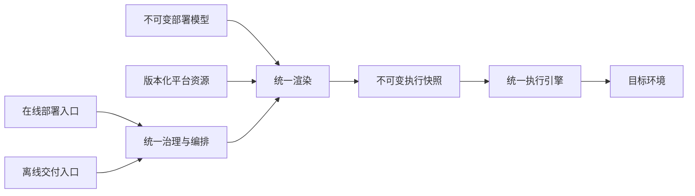
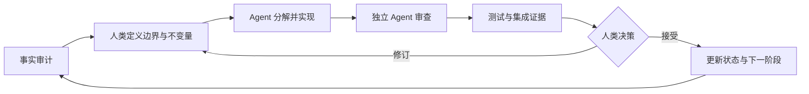

## 缘起

我正在推进一项企业级交付平台的长期重构：把两条独立演化多年的在线与离线部署链路，收敛到统一的治理、渲染和执行模型。

这项工作横跨多个系统和代码仓库，涉及数据权威、版本模型、任务编排、持久队列、并发控制、历史兼容、故障恢复和分阶段迁移。我是这项融合的技术负责人，负责整体方案、长期路线、关键决策和主要实现。日常执行协作者主要是多个 Agent；组织上由小组 Leader 提供业务优先级、资源协调和外部校准。

这个经历促使我重新理解 Senior、Staff 与 Principal 的区别：职级不只是编码能力的排序，也不能简单用带领人数衡量。它更接近一个人在多大范围、多长时间尺度和多高不确定性下，能够持续做出正确判断，并让这些判断成为可执行的系统约束。

> 职级是组织授予的角色；Staff 级工作则是一类可以被观察和验证的工程活动。两者相关，但并不等价。

## Senior、Staff 与 Principal 的分界

不同公司的职级体系并不完全一致。下面的对比不用于机械映射职级，而用于描述三类常见的工程作用范围。

| 维度 | Senior | Staff | Principal |
|---|---|---|---|
| 问题来源 | 解决已经明确的重要问题 | 发现并定义跨系统问题 | 判断哪些组织级问题值得投入 |
| 作用范围 | 一个服务或一个团队 | 多个系统、多个团队或一个技术领域 | 一条业务线、一个平台方向或整个组织 |
| 时间尺度 | 当前版本到数个季度 | 一至三年的演进路径 | 多年技术方向与组织能力建设 |
| 核心产出 | 高质量设计与实现 | 边界、契约、迁移路径和跨团队共识 | 可持续的技术方向、机制和继任体系 |
| 主要风险 | 模块实现错误 | 系统边界或迁移决策错误 | 组织长期投入方向错误 |

Senior 通常在边界明确的范围内完成复杂设计。Staff 更常处理跨系统、跨团队或贯穿一个技术领域的问题，定义职责、依赖方向和长期边界。Principal 还要进一步回答：这个方向是否值得组织长期投入，能否成为多个团队共同采用的标准，以及在设计者离开后是否仍能继续演进。

因此，一个复杂项目可以体现 Staff 甚至部分 Principal 的能力特征，但单个项目本身不能自动证明 Principal 级影响力。后者还需要持续的组织采用、跨领域复用和继任能力作为证据。

## 一个脱敏的跨系统融合案例

### 两条链路为什么需要收敛

目标平台最初有两条部署链路：

- 在线链路面向日常集成，追求快速反馈，直接进入在线执行器；
- 离线链路面向环境交付，先经过交付编排中心，再由离线执行器完成部署。

它们独立演化后形成了三类分歧：

| 分歧 | 表现 | 后果 |
|---|---|---|
| 治理分歧 | 在线链路绕过统一的规划、排序和准入规则 | 在线验证不能证明离线交付行为一致 |
| 执行语义分歧 | 两条链路使用不同的模板、变量和资源补全方式 | 同一部署定义在不同链路产生不同结果 |
| 版本语义分歧 | 当前版本、目标版本和可交付版本被混为一个概念 | 跨版本部署、升级和回滚缺少稳定边界 |

问题的本质不是两个接口不同，而是两个系统对同一业务事实拥有不同解释。如果只复用部分代码或增加适配参数，分歧会继续存在，只是被藏到更深的调用链中。

### 目标态不是合并系统，而是统一权威

收敛后的长期链路可以概括为：

这张图容易产生一个误解：统一链路意味着把全部数据塞进一个请求。实际设计采用了相反的方法，每个数据域只保留一个长期权威位置。

| 数据域 | 权威位置 | 设计理由 |
|---|---|---|
| 产品与应用部署模型 | 不可变的部署模型版本 | 与产品修订共同演进，可追溯和回滚 |
| 平台级配置与资源 | 按平台版本保存的资源文件树 | 不应被某次应用修订永久锁定 |
| 部署意图和任务图 | 编排中心的工作流聚合 | 承担幂等、状态、日志和并发治理 |
| 用户确认后的执行内容 | 单应用不可变快照 | 重试必须读取同一份字节，而不是重新渲染 |
| 运行时资源状态 | 目标环境服务 | 执行时允许动态读取，但不能改写静态输入 |

统一的核心不是数据集中，而是语义集中：同一个问题只能有一个权威回答，其余系统通过引用、投影或受约束的兼容接口消费该答案。

## 这项工作为什么具有 Staff 级特征

### 1. 先定义问题，再选择技术

如果把任务描述为“让在线入口调用离线接口”，实现会集中在 API 适配和字段转换。真正的问题是治理语义、执行语义和版本语义同时分裂。因此，方案首先定义目标不变量，再选择接口、表结构和迁移步骤。

这种顺序很重要：技术选择服务于问题定义，而不是由已有代码结构反向决定目标架构。

### 2. 为每个数据域指定唯一权威

大型系统最常见的腐化来源之一，是同一个概念在多个系统中各自保存并独立更新。初期看起来能够降低调用成本，长期则会形成无法解释的数据漂移。

本次设计没有创建一个覆盖所有语义的“大部署对象”，而是逐项回答：谁生产、谁保存、谁可以修改、谁只能引用、何时固化、失败时是否允许换源。数据边界由生命周期决定，而不是由哪个数据库当前已经存在对应字段决定。

### 3. 把迁移路径视为架构的一部分

目标态设计只回答“最终去哪里”，生产系统还必须回答“怎样从这里走过去”。这项重构没有采用一次性切换，而是把迁移拆为四类阶段：

1. 先在同版本范围验证完整的新链路；
2. 再解除跨版本执行限制；
3. 在执行稳定后逐步恢复和增强治理规则；
4. 最后清理旧执行器和历史载体。

每个阶段都复用长期链路，不建设验证结束后再删除的临时数据通道。路由策略只影响新创建的部署记录，已经运行的记录继续按创建时固化的执行模式收敛。这避免了迁移过程中修改在途操作的所有权。

### 4. 用不变量设计并发与恢复

编排系统不仅要回答任务如何启动，还要回答重复提交、并发冲突、控制器切换、执行中止和失败重试如何收敛。

这里的层级作用域按目标资源路径定义：产品覆盖其全部服务和应用，服务覆盖其下应用，单个应用只覆盖自身。祖先路径与后代路径相互冲突，兄弟服务或兄弟应用可以并行。

设计采用持久等待状态接纳所有合法意图，再由单活控制器根据这些作用域决定何时启动。更早但被阻塞的工作流会在自己的冲突路径上形成顺序屏障，阻止后续相交操作越过；无关作用域仍可并行，从而避免全局队列的队头阻塞。

状态机还有一个关键不变量：工作流只有在全部子任务都已静态后才能进入完成或失败终态。这里的“静态”指子任务已经成功、失败、取消或被显式豁免，不会再被控制器继续推进。终态不是一次 API 调用的结果，而是并发作用域可以安全释放的证明。

不可变快照进一步改变了恢复模型。重试不能重新读取部署模型和版本资源，否则旧操作会获得新的输入。需要外部修复时，运维必须显式豁免精确子树，也就是某个服务节点及其下属应用和附属任务；随后创建新的修复工作流，再让原工作流使用原快照继续剩余步骤。

### 5. 明确写出系统不保证什么

成熟设计不只列出新增能力，还应明确拒绝的机制和非目标。本次设计明确不建设：

- 在线与离线执行器之间的统一分布式锁；
- 失败后自动切换旧执行链路；
- 第二张部署状态表或第二个操作标识；
- 为单活调度器叠加多套长期锁、租约和版本栅栏；
- 在本阶段承诺外部副作用恰好执行一次。

这些选择不是忽略风险，而是把保证限定在能够证明的边界内。每增加一种并发机制、兼容回退或数据副本，都会形成新的状态空间和长期维护成本。

## Staff 级工作与 Principal 级影响力

这项工作的跨系统范围、长期目标态、并发模型、迁移设计和已经推进的核心实现，体现出明显的 Staff 级工作特征。但 Principal 更强调组织层面的持续影响，不能只由设计复杂度推导。

| 已经能够观察的证据 | 仍需长期验证的证据 |
|---|---|
| 跨多个系统定义统一边界 | 是否成为多个团队共同维护的正式标准 |
| 同时设计目标态与分阶段迁移 | 是否在其他技术领域形成可复用机制 |
| 从事实审计推进到核心实现 | 是否培养出能够独立维护和演进该架构的人 |
| 主动删除过度设计和第二权威 | 是否持续影响组织的技术决策方式 |

因此，更准确的说法不是“完成一个复杂项目就获得某个职级”，而是：项目展示了相应层级所要求的能力证据。正式职级还包含组织授权、持续影响和结果责任。

## 当协作者主要是 Agent

### 角色没有消失，而是重新分配

传统团队中，架构师通过会议、评审、结对和代码审查传播判断。在融合技术负责人、多 Agent 和小组 Leader 的协作模式下，这些职责被重新分配。

| 角色 | 主要责任 |
|---|---|
| 融合技术负责人（作者） | 定义问题、设计目标架构和长期路线、选择不变量、完成关键实现并承担技术结果责任 |
| Agent | 跨仓事实审计、方案对比、实现、测试、文档同步和重复性检查 |
| 小组 Leader | 校准业务优先级和组织约束、协调资源、确认风险容忍度和上线边界，并提供组织层面的外部挑战 |

Agent 可以显著扩大一个人的探索和实现带宽，但不能替代责任主体。它不会承担生产事故后果，也不能独立判断组织是否愿意支付迁移成本。融合技术负责人仍然拥有方案和实现的技术所有权，小组 Leader 则提供业务与组织语境中的外部约束和支持。

### 架构影响力被编码进仓库

当缺少传统团队的口头同步时，设计判断必须以 Agent 能够读取和执行的形式存在。仓库中的知识结构因而成为协作基础：

- 事实层只记录当前系统已经验证的行为；
- 架构文档定义长期权威和组件边界；
- 契约文档冻结状态机、不变量和失败语义；
- 状态文档区分已设计、已实现和已验证；
- 执行计划把跨仓任务拆成可关闭的工作包；
- 测试和质量门禁把判断转成默认执行的约束。

这与[仓库即环境](/posts/ai-agent/repo-as-agent-environment/)讨论的是同一个问题：Agent 的上限不仅由模型能力决定，也由仓库是否提供清晰入口、组织记忆和验证闭环决定。

在这种模式中，文档不是实现之后的说明材料，而是并行 Agent 共享上下文、避免语义漂移和恢复工作状态的控制面。

### Agent 协作也会放大风险

没有传统团队并不意味着没有协作成本。相反，部分风险会更加集中：

- 多个 Agent 可能沿用同一错误前提，形成表面一致的错误结论；
- Agent 容易优化局部实现，忽略长期数据权威和迁移边界；
- 大量并行产出会提高审阅负担，设计者可能成为新的吞吐瓶颈；
- 文档可以降低知识丢失，但不能替代真实的人类继任者；
- 代码通过本地验证，不等于跨系统集成和生产容量已经成立。

对应的控制方法包括独立事实层、不同上下文的交叉审查、明确的非目标、可执行测试、真实环境门禁，以及把“代码已落地”和“生产已验证”分开记录。

## 一人多 Agent 模式下的工作循环

这类长期重构可以采用以下循环：

其中，融合技术负责人不需要逐行完成全部实现，但必须牢牢掌握三个位置：问题定义、不可逆取舍和证据验收。Agent 更适合承担可并行、可验证和能够从仓库恢复上下文的任务。

为了使这个循环长期可用，仓库至少需要七类产物：

1. 当前系统事实和代码证据；
2. 一句话说明的长期目标；
3. 数据权威和组件职责表；
4. 状态机、不变量、失败语义和非目标；
5. 可独立投产与回滚的阶段路线；
6. 设计、实现和验证分离的状态账本；
7. 与每个阶段对应的自动化和真实环境证据。

这些产物同时服务人类和 Agent。它们把架构从个人脑中的判断，转变为仓库中可检查、可执行和可修订的工程系统。

## 结语

Staff 级工作的判断标准不是团队人数，也不是代码行数。更有解释力的标准是：能否定义跨系统问题，建立长期权威边界，设计可行迁移路径，处理并发与恢复，并让其他执行者在不依赖口头解释的情况下继续推进。

一个人借助 Agent 可以完成过去需要多人并行才能推进的大量事实审计、实现和验证工作。这提高了个人可触达的系统规模，但没有减少架构责任。相反，问题定义、取舍质量、证据标准和最终结果会更加集中到设计者身上。

三个问题可以用于审视类似工作：

- 当前解决的是一个复杂实现问题，还是一个尚未被正确描述的系统问题？
- 目标架构是否同时包含数据权威、失败语义、迁移路线和明确的非目标？
- 如果设计者暂时离开，仓库中的人类或 Agent 能否根据现有证据继续作出一致决策？
